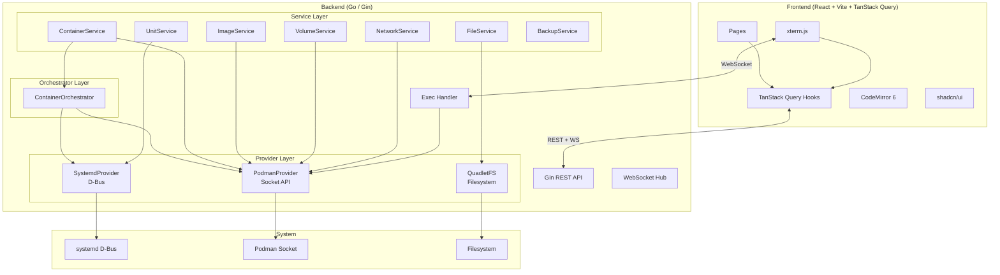

# Quadlet Manager Redesign — Design Spec

> **Date:** 2026-05-17
> **Status:** Draft
> **Scope:** Full-featured Podman/Systemd orchestrator with management CRUD, Web Terminal, backup/restore, and alerts. Auth/Settings modules preserved as-is.

---

## 1. Goals

Transform Quadlet Manager from a read-heavy dashboard into a proper **manager** — on par with Portainer for personal/homelab use, but rooted in the Quadlet declarative model.

**Non-goals:** Enterprise RBAC granularity, multi-cluster management, image build/push, registry integration.

---

## 2. Architecture Overview



**Key design principle — Dual-Track Orchestrator:**
- Quadlet-managed containers (have `io.containers.systemd.unit` label) → route through Systemd D-Bus
- Orphan containers (no systemd unit) → route through Libpod API directly
- The `ContainerOrchestrator` decides which track to use per operation

---

## 3. Backend Design

### 3.1 Directory Structure (changes only)

```
internal/
├── provider/
│   ├── systemd.go              # KEEP — SystemdProvider interface
│   ├── systemd_dbus.go         # KEEP — D-Bus implementation
│   ├── podman.go               # REWRITE — expanded interface
│   ├── podman_socket.go        # REWRITE — expanded implementation + version detection
│   ├── quadletfs.go            # KEEP
│   └── quadletfs_impl.go       # KEEP
├── service/
│   ├── unit_service.go         # KEEP
│   ├── file_service.go         # KEEP
│   ├── container_service.go    # REWRITE — full CRUD via orchestrator
│   ├── image_service.go        # NEW
│   ├── volume_service.go       # NEW
│   ├── network_service.go      # NEW
│   ├── backup_service.go       # NEW
│   └── orchestrator.go         # NEW — ContainerOrchestrator
├── handler/
│   ├── unit_handler.go         # KEEP
│   ├── file_handler.go         # KEEP — improve error handling
│   ├── container_handler.go    # REWRITE — add lifecycle + exec endpoints
│   ├── image_handler.go        # NEW
│   ├── volume_handler.go       # NEW
│   ├── network_handler.go      # NEW
│   ├── exec_handler.go         # NEW — WebSocket exec handler
│   ├── backup_handler.go       # NEW
│   ├── stats_handler.go        # KEEP
│   ├── system_handler.go       # KEEP
│   └── settings_handler.go     # KEEP
├── ws/
│   └── hub.go                  # EXTEND — add unit_failed event type
└── middleware/
    ├── cors.go                 # KEEP
    ├── logger.go               # KEEP
    └── auth.go                 # KEEP
```

### 3.2 PodmanProvider Interface (expanded)

```go
type PodmanProvider interface {
    Connect(ctx context.Context) error
    Close()
    APIVersion() string

    // Container lifecycle
    ListContainers(ctx context.Context) ([]ContainerInfo, error)
    GetContainerStats(ctx context.Context, id string) (*ContainerStats, error)
    GetAllStats(ctx context.Context) ([]ContainerStats, error)
    GetContainerLogs(ctx context.Context, id string, tail int) ([]string, error)
    StartContainer(ctx context.Context, id string) error
    StopContainer(ctx context.Context, id string, timeout *int) error
    RestartContainer(ctx context.Context, id string, timeout *int) error
    PauseContainer(ctx context.Context, id string) error
    UnpauseContainer(ctx context.Context, id string) error
    RemoveContainer(ctx context.Context, id string, force bool) error
    InspectContainer(ctx context.Context, id string) (map[string]any, error)

    // Container exec (returns exec session ID)
    ExecCreate(ctx context.Context, containerID string, cmd []string, tty bool) (string, error)
    ExecAttach(ctx context.Context, execID string) (net.Conn, error)
    ExecResize(ctx context.Context, execID string, height, width uint) error

    // Images
    ListImages(ctx context.Context) ([]ImageInfo, error)
    PullImage(ctx context.Context, name string) error
    RemoveImage(ctx context.Context, id string, force bool) error
    InspectImage(ctx context.Context, id string) (map[string]any, error)

    // Volumes
    ListVolumes(ctx context.Context) ([]VolumeInfo, error)
    CreateVolume(ctx context.Context, name string, labels map[string]string) (*VolumeInfo, error)
    RemoveVolume(ctx context.Context, name string, force bool) error
    InspectVolume(ctx context.Context, name string) (map[string]any, error)

    // Networks
    ListNetworks(ctx context.Context) ([]NetworkInfo, error)
    CreateNetwork(ctx context.Context, name, driver string, subnet string) error
    RemoveNetwork(ctx context.Context, name string) error
    InspectNetwork(ctx context.Context, name string) (map[string]any, error)
}
```

**API version detection:** On `Connect()`, call `GET /libpod/info`, parse `Version.APIVersion`, store it. All subsequent calls use `/{apiVersion}/libpod/...` instead of hardcoded `v5.0.0`.

### 3.3 ContainerOrchestrator

```go
type ContainerOrchestrator struct {
    systemd  SystemdProvider
    podman   PodmanProvider
    fileSvc  *FileService
}

// IsManaged checks if a container is Quadlet-managed.
// Logic: inspect container → check Labels["io.containers.systemd.unit"]
// or check SourcePath in container inspect data against quadlet dir.
func (o *ContainerOrchestrator) IsManaged(ctx context.Context, containerID string) (bool, string, error)

// Start routes to D-Bus or Libpod based on IsManaged result.
func (o *ContainerOrchestrator) Start(ctx context.Context, containerID string) error {
    managed, unitName, err := o.IsManaged(ctx, containerID)
    if err != nil {
        return err
    }
    if managed {
        return o.systemd.StartUnit(ctx, unitName)
    }
    return o.podman.StartContainer(ctx, containerID)
}

// Same pattern for Stop, Restart, Remove
```

### 3.4 Web Terminal (Exec)

```go
// exec_handler.go

// ExecCreate — POST /api/v1/containers/:id/exec
// Creates an exec session via Podman API, returns exec_id
func (h *ExecHandler) ExecCreate(c *gin.Context) {
    id := c.Param("id")
    var req struct {
        Cmd []string `json:"cmd"`
    }
    if err := c.BindJSON(&req); err != nil || len(req.Cmd) == 0 {
        req.Cmd = []string{"/bin/sh"}
    }
    execID, err := h.podman.ExecCreate(c.Request.Context(), id, req.Cmd, true)
    // return { "exec_id": execID }
}

// ExecWebSocket — GET /api/v1/containers/:id/exec/:exec_id/ws
// Hijacks the HTTP connection to Podman exec attach, bridges to WebSocket
func (h *ExecHandler) ExecWebSocket(c *gin.Context) {
    execID := c.Param("exec_id")

    // Upgrade to WebSocket
    conn, _ := websocketUpgrader.Upgrade(c.Writer, c.Request, nil)
    defer conn.Close()

    // Attach to Podman exec session (HTTP hijack)
    podmanConn, _ := h.podman.ExecAttach(c.Request.Context(), execID)
    defer podmanConn.Close()

    // Bidirectional bridge with TTY resize support
    done := make(chan struct{})
    go func() {
        // WebSocket → Podman
        for {
            _, msg, err := conn.ReadMessage()
            if err != nil { break }
            if isResizeMessage(msg) {
                h.podman.ExecResize(ctx, execID, height, width)
                continue
            }
            podmanConn.Write(msg)
        }
        close(done)
    }()
    go func() {
        // Podman → WebSocket
        buf := make([]byte, 32*1024)
        for {
            n, err := podmanConn.Read(buf)
            if err != nil { break }
            conn.WriteMessage(websocket.BinaryMessage, buf[:n])
        }
        close(done)
    }()
    <-done
}
```

**Resize protocol:** Frontend sends JSON text frames `{"type":"resize","cols":80,"rows":24}` over the same WebSocket. Backend distinguishes resize messages from terminal input by checking if the message is valid JSON with a `"type":"resize"` field. Terminal input is always raw binary frames. Backend calls `ExecResize(ctx, execID, height, width)` on Podman.

### 3.5 Backup Service

```go
type BackupService struct {
    quadletFS QuadletFS
    db        *store.DB
    quadletDir string
}

// Export — tar.gz of all quadlet files + settings JSON (no password hashes)
func (s *BackupService) Export(ctx context.Context) ([]byte, error)

// Import — extract tar.gz to quadlet dir, upsert settings, daemon-reload
func (s *BackupService) Import(ctx context.Context, data []byte) error
```

Tar.gz contents:
```
backup.tar.gz
├── *.container
├── *.volume
├── *.network
└── settings.json    # language, quadlet_dir, podman_socket (no auth data)
```

### 3.6 Alert System

Extend WebSocket hub with a `unit_failed` event type:

```go
// In stats broadcaster or a separate alert ticker:
// Poll unit statuses every 5s, compare with previous state
// If any unit transitions to "failed", broadcast:
hub.Broadcast(Message{
    Type: "unit_failed",
    Data: map[string]any{
        "name":   unitName,
        "status": "failed",
        "sub_status": subState,
    },
})
```

### 3.7 API Routes (new/changed)

| Method | Path | Handler | Description |
|--------|------|---------|-------------|
| POST | `/api/v1/containers/:id/start` | ContainerHandler | Start container (via orchestrator) |
| POST | `/api/v1/containers/:id/stop` | ContainerHandler | Stop container |
| POST | `/api/v1/containers/:id/restart` | ContainerHandler | Restart container |
| POST | `/api/v1/containers/:id/pause` | ContainerHandler | Pause container |
| POST | `/api/v1/containers/:id/unpause` | ContainerHandler | Unpause container |
| DELETE | `/api/v1/containers/:id` | ContainerHandler | Remove container |
| GET | `/api/v1/containers/:id/inspect` | ContainerHandler | Inspect details |
| GET | `/api/v1/containers/:id/logs` | ContainerHandler | Container logs (existing) |
| POST | `/api/v1/containers/:id/exec` | ExecHandler | Create exec session |
| GET | `/api/v1/containers/:id/exec/:exec_id/ws` | ExecHandler | WebSocket exec attach |
| POST | `/api/v1/images/pull` | ImageHandler | Pull image |
| DELETE | `/api/v1/images/:id` | ImageHandler | Remove image |
| GET | `/api/v1/images/:id/inspect` | ImageHandler | Image details |
| POST | `/api/v1/volumes` | VolumeHandler | Create volume |
| DELETE | `/api/v1/volumes/:name` | VolumeHandler | Remove volume |
| GET | `/api/v1/volumes/:name/inspect` | VolumeHandler | Volume details |
| POST | `/api/v1/networks` | NetworkHandler | Create network |
| DELETE | `/api/v1/networks/:name` | NetworkHandler | Remove network |
| GET | `/api/v1/networks/:name/inspect` | NetworkHandler | Network details |
| GET | `/api/v1/backup/export` | BackupHandler | Download backup tar.gz |
| POST | `/api/v1/backup/import` | BackupHandler | Upload & restore backup |

---

## 4. Frontend Design

### 4.1 State Management Migration

**Remove:** `useContainers.ts` (Zustand store with fetch logic)
**Keep:** `useAuth.ts`, `useApp.ts` (client-side state only)

**New TanStack Query hooks:**

```typescript
// src/hooks/useContainers.ts
export function useContainers() {
  return useQuery({ queryKey: ['containers'], queryFn: api.listContainers, refetchInterval: 10_000 })
}

export function useContainerStats() {
  return useQuery({ queryKey: ['stats'], queryFn: api.getStats, refetchInterval: 3_000 })
}

export function useStartContainer() {
  const qc = useQueryClient()
  return useMutation({
    mutationFn: (id: string) => api.startContainer(id),
    onSuccess: () => qc.invalidateQueries({ queryKey: ['containers'] }),
  })
}
// ... same pattern for stop, restart, pause, remove, etc.
```

Each resource (images, volumes, networks, units, files) gets its own hook file in `src/hooks/`.

### 4.2 Page Upgrades

**ContainersPage:**
- Table columns: Name, Image, State (badge), CPU%, MEM%, Actions
- Row actions: Start / Stop / Restart (conditional on state), Pause, Remove (with AlertDialog), Logs (side drawer), Terminal (navigate to /exec/:id)
- Top bar: search filter, state filter (running/stopped/all), refresh button
- Uses `useContainers()` + `useContainerStats()` hooks

**ImagesPage:**
- Table: Repository, Tag, ID, Size, Created, Actions
- Actions: Pull (dialog with image:tag input), Remove (AlertDialog), Inspect (side panel)
- Uses `useImages()` + mutations

**VolumesPage:**
- Table: Name, Driver, Mountpoint, Actions
- Actions: Create (dialog), Remove (AlertDialog), Inspect
- Uses `useVolumes()` + mutations

**NetworksPage:**
- Table: Name, Driver, Subnet, Gateway, Actions
- Actions: Create (dialog with name/driver/subnet), Remove (AlertDialog), Inspect
- Uses `useNetworks()` + mutations

**New TerminalPage (`/containers/:id/exec`):**
- Full-screen xterm.js terminal
- Connects to WebSocket `/api/v1/containers/:id/exec/:exec_id/ws`
- Resize handling: `terminal.onResize` → send resize message over WS
- Disconnect button, fullscreen toggle

**New BackupPage (`/backup`):**
- Export button → downloads tar.gz
- Import area → drag-drop or file picker → upload → confirm → daemon-reload

### 4.3 Global Improvements

- **Toast notifications:** Replace all `alert()` with shadcn/ui `sonner` toast
- **AlertDialog:** All destructive actions (delete container, remove image, etc.) require confirmation
- **Error boundary:** React ErrorBoundary at router level
- **Lazy loading:** `React.lazy()` for each page component in router
- **Auto-refresh:** TanStack Query `refetchInterval` for stats (3s), containers (10s), units (10s)

### 4.4 New Dependencies

```json
{
  "@tanstack/react-query": "^5.x",
  "@xterm/xterm": "^5.x",
  "@xterm/addon-fit": "^0.10.x",
  "@xterm/addon-web-links": "^0.11.x",
  "sonner": "^1.x"
}
```

Remove: direct `useState`-based data fetching in ImagesPage, VolumesPage, NetworksPage.

---

## 5. Database Schema

Existing tables preserved. No schema changes needed — `users`, `user_settings`, `audit_logs` are sufficient.

---

## 6. Development Environment

### Primary: Makefile

```makefile
dev: dev-backend dev-frontend

dev-backend:
	go run ./cmd/quadlet-manager --dev --port 8080

dev-frontend:
	cd web && pnpm dev

build:
	cd web && pnpm build
	go build -o bin/quadlet-manager ./cmd/quadlet-manager

test:
	go test ./...
	cd web && pnpm test

lint:
	golangci-lint run
	cd web && pnpm lint
```

### Optional: Nix Flake

```nix
{
  inputs.nixpkgs.url = "github:NixOS/nixpkgs/nixpkgs-unstable";
  outputs = { self, nixpkgs }:
    let
      pkgs = nixpkgs.legacyPackages.x86_64-linux;
    in {
      devShells.x86_64-linux.default = pkgs.mkShell {
        buildInputs = [
          pkgs.go_1_22 pkgs.gopls pkgs.golangci-lint
          pkgs.nodejs_20 pkgs.pnpm
          pkgs.sqlite pkgs.pkg-config pkgs.gcc
        ];
      };
    };
}
```

---

## 7. Implementation Phases

| Phase | Scope | Key Files |
|-------|-------|-----------|
| **P1** | PodmanProvider expansion + API version detection | `podman.go`, `podman_socket.go` |
| **P2** | ContainerOrchestrator + new Services | `orchestrator.go`, `image_service.go`, `volume_service.go`, `network_service.go` |
| **P3** | New Handlers + route registration | `image_handler.go`, `volume_handler.go`, `network_handler.go`, `exec_handler.go`, `backup_handler.go` |
| **P4** | Frontend TanStack Query migration | Remove `useContainers.ts` store, add `src/hooks/*`, update all pages |
| **P5** | ContainersPage full management | `ContainersPage.tsx`, container hooks, AlertDialog, toast |
| **P6** | ImagesPage / VolumesPage / NetworksPage CRUD | Dialogs, mutations, inspect panels |
| **P7** | Web Terminal (exec) | `exec_handler.go`, `TerminalPage.tsx`, xterm.js integration |
| **P8** | Backup/Restore + Alerts | `backup_service.go`, `backup_handler.go`, `BackupPage.tsx`, WS `unit_failed` event |
| **P9** | Global polish | Lazy loading, error boundary, toast system, auto-refresh tuning |

---

## 8. Security Considerations

- **Exec session validation:** Each exec session tied to authenticated user, auto-expire after 30min idle
- **Backup import:** Validate tar.gz contents — only allow quadlet extensions, no directory traversal
- **WebSocket origin:** `CheckOrigin` should validate against configured allowed origins (fix current `return true`)
- **Container remove:** Force-remove requires admin role
- **Path sanitization:** Already implemented in `QuadletFS` — no changes needed

---

## 9. Testing Strategy

- **Provider layer:** Mock implementations already exist; extend mocks for new methods
- **Orchestrator:** Unit test with mock providers — verify correct routing (D-Bus vs Libpod)
- **Handlers:** HTTP handler tests with mock services (pattern already exists in `handler_test.go`)
- **Frontend:** Component tests for key interactions (start/stop, pull image, create volume)
- **Integration:** Manual testing on Linux with real Podman + systemd
