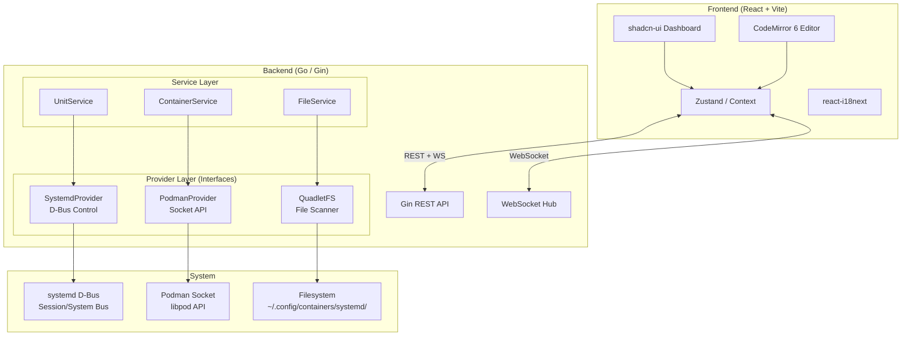

# Quadlet Manager — Implementation Plan

A high-performance Podman/Systemd orchestrator bridging a modern web UI with Podman's Quadlet system via systemd D-Bus.

---

## User Review Required

> [!IMPORTANT]
> **Frontend Framework Alignment:** The UI demo at `quadlet-manager-ui-demo` is built in **React**. As requested, this project will also use **React + shadcn/ui**. The React demo will be used as a design and implementation reference. Files path: `/home/choken/code/quadlet-manager-ui-demo`.


> [!IMPORTANT]
> **CodeMirror vs Monaco:** The demo uses Monaco Editor. The spec calls for **CodeMirror 6** with Quadlet syntax support. This plan uses CodeMirror 6 with a custom INI/Quadlet language mode, which is lighter-weight and more suitable for embedding.

> [!WARNING]
> **Target Environment:** This tool is designed to run on **Linux** with systemd and Podman installed. The Go backend D-Bus and Podman socket features will not function on macOS. Development can proceed on macOS (frontend + mocked backend), but testing requires a Linux VM or container.

## Open Questions

> [!IMPORTANT]
> **Authentication Model:** Should the web UI require authentication (JWT/session)? For a local tool this may not be needed, but for remote access it's critical. **Current assumption: no auth for v1, behind localhost only.**

> [!IMPORTANT]
> **WebSocket vs SSE for Real-time:** For streaming container stats and unit status changes, should we use WebSocket or Server-Sent Events? **Current assumption: WebSocket** for bidirectional communication (stats + D-Bus signal forwarding).

---

## Architecture Overview



---

## Project Structure

```
quadlet-manager/
├── cmd/
│   └── quadlet-manager/
│       └── main.go                    # Entry point, wire everything
├── internal/
│   ├── config/
│   │   └── config.go                  # App configuration (env, flags)
│   ├── provider/
│   │   ├── systemd.go                 # SystemdProvider interface
│   │   ├── systemd_dbus.go            # D-Bus implementation (rootless/rootful)
│   │   ├── podman.go                  # PodmanProvider interface
│   │   ├── podman_socket.go           # Libpod socket implementation
│   │   ├── quadletfs.go               # QuadletFS interface
│   │   └── quadletfs_impl.go          # Filesystem scanner implementation
│   ├── service/
│   │   ├── unit_service.go            # Unit lifecycle orchestration
│   │   ├── container_service.go       # Container stats & info
│   │   └── file_service.go            # Quadlet file CRUD + validation
│   ├── handler/
│   │   ├── unit_handler.go            # REST handlers for units
│   │   ├── container_handler.go       # REST handlers for containers
│   │   ├── file_handler.go            # REST handlers for file operations
│   │   ├── stats_handler.go           # Stats + WebSocket handler
│   │   └── system_handler.go          # System info endpoint
│   ├── model/
│   │   ├── unit.go                    # Unit status models
│   │   ├── container.go               # Container models
│   │   ├── quadlet.go                 # Quadlet file models
│   │   └── stats.go                   # Stats models
│   ├── middleware/
│   │   ├── cors.go                    # CORS middleware
│   │   └── logger.go                  # Request logger
│   ├── ws/
│   │   └── hub.go                     # WebSocket hub for real-time events
│   └── parser/
│       ├── quadlet_parser.go          # Parse .container/.volume/.network files
│       └── quadlet_generator.go       # Generate Quadlet files from form data
├── web/                               # React frontend (embedded in binary)
│   ├── index.html
│   ├── package.json
│   ├── vite.config.ts
│   ├── tsconfig.json
│   ├── components.json                # shadcn-ui config
│   ├── src/
│   │   ├── main.tsx
│   │   ├── App.tsx
│   │   ├── api/
│   │   │   ├── client.ts              # Axios/fetch wrapper
│   │   │   ├── units.ts               # Unit API calls
│   │   │   ├── containers.ts          # Container API calls
│   │   │   └── files.ts               # File API calls
│   │   ├── store/
│   │   │   ├── useUnits.ts            # Zustand unit store
│   │   │   ├── useContainers.ts       # Zustand container store
│   │   │   └── useApp.ts              # App-level state (theme, locale)
│   │   ├── hooks/
│   │   │   ├── useWebSocket.ts        # WebSocket hook
│   │   │   └── useQuadletEditor.ts    # CodeMirror hook
│   │   ├── components/
│   │   │   ├── ui/                    # shadcn-ui components
│   │   │   ├── layout/
│   │   │   │   ├── AppSidebar.tsx
│   │   │   │   ├── AppHeader.tsx
│   │   │   │   └── AppLayout.tsx
│   │   │   ├── units/
│   │   │   │   ├── UnitList.tsx
│   │   │   │   ├── UnitCard.tsx
│   │   │   │   └── ServiceControl.tsx
│   │   │   ├── editor/
│   │   │   │   ├── QuadletEditor.tsx  # CodeMirror 6 wrapper
│   │   │   │   └── ViewToggle.tsx
│   │   │   ├── wizard/
│   │   │   │   ├── ConfigWizard.tsx
│   │   │   │   ├── ImageSection.tsx
│   │   │   │   ├── PortSection.tsx
│   │   │   │   ├── VolumeSection.tsx
│   │   │   │   └── EnvSection.tsx
│   │   │   └── dashboard/
│   │   │       ├── DashboardView.tsx
│   │   │       ├── StatsCard.tsx
│   │   │       └── StatusOverview.tsx
│   │   ├── pages/
│   │   │   ├── DashboardPage.tsx
│   │   │   ├── ContainersPage.tsx
│   │   │   ├── ImagesPage.tsx
│   │   │   ├── VolumesPage.tsx
│   │   │   ├── NetworksPage.tsx
│   │   │   └── SettingsPage.tsx
│   │   ├── router/
│   │   │   └── index.tsx
│   │   ├── i18n/
│   │   │   ├── index.ts
│   │   │   ├── en.json
│   │   │   └── zh.json
│   │   └── styles/
│   │       └── globals.css
│   └── public/
├── go.mod
├── go.sum
├── Makefile
└── README.md
```

---

## Proposed Changes

### Phase 1: Backend Foundation

---

#### [NEW] [main.go](file:///Users/choken/code/quadlet-manager/cmd/quadlet-manager/main.go)

Entry point that:
- Parses CLI flags (`--port`, `--rootless`, `--quadlet-dir`)
- Detects rootless vs rootful environment
- Initializes provider layer → service layer → handler layer
- Sets up Gin router with middleware (CORS, logging)
- Embeds and serves the React frontend via `embed.FS`
- Starts WebSocket hub for real-time events

---

#### [NEW] [config.go](file:///Users/choken/code/quadlet-manager/internal/config/config.go)

Application configuration struct with environment detection:

```go
type Config struct {
    Port        int
    Rootless    bool
    QuadletDir  string    // Override scan directory
    PodmanSocket string   // Override socket path
    DevMode     bool      // Proxy to Vite dev server
}
```

Auto-detection logic:
- `Rootless = os.Getuid() != 0`
- `QuadletDir` defaults to `~/.config/containers/systemd/` (rootless) or `/etc/containers/systemd/` (rootful)
- `PodmanSocket` defaults to `/run/user/{UID}/podman/podman.sock` (rootless) or `/run/podman/podman.sock` (rootful)

---

#### [NEW] [systemd.go](file:///Users/choken/code/quadlet-manager/internal/provider/systemd.go)

**SystemdProvider interface** — the testable abstraction for all systemd operations:

```go
type SystemdProvider interface {
    // Connection management
    Connect(ctx context.Context) error
    Close()
    IsRootless() bool

    // Unit lifecycle
    DaemonReload(ctx context.Context) error
    StartUnit(ctx context.Context, name string) error
    StopUnit(ctx context.Context, name string) error
    RestartUnit(ctx context.Context, name string) error
    EnableUnit(ctx context.Context, name string) error
    DisableUnit(ctx context.Context, name string) error

    // Unit introspection
    ListUnits(ctx context.Context) ([]UnitStatus, error)
    GetUnitStatus(ctx context.Context, name string) (*UnitStatus, error)

    // Signal monitoring
    SubscribeUnitChanges(ctx context.Context) (<-chan UnitChangeEvent, error)
}
```

---

#### [NEW] [systemd_dbus.go](file:///Users/choken/code/quadlet-manager/internal/provider/systemd_dbus.go)

**D-Bus implementation** — the critical rootless detection logic:

```go
func NewDBusSystemdProvider(rootless bool) *DBusSystemdProvider {
    return &DBusSystemdProvider{rootless: rootless}
}

func (p *DBusSystemdProvider) Connect(ctx context.Context) error {
    var conn *dbus.Conn
    var err error

    if p.rootless {
        // Connect to user session bus
        // This uses DBUS_SESSION_BUS_ADDRESS / XDG_RUNTIME_DIR internally
        conn, err = dbus.NewUserConnectionContext(ctx)
    } else {
        // Connect to system bus (requires root)
        conn, err = dbus.NewSystemConnectionContext(ctx)
    }
    if err != nil {
        return fmt.Errorf("dbus connect (rootless=%v): %w", p.rootless, err)
    }
    p.conn = conn
    return nil
}
```

Key implementation details:
- **Connection pooling:** Single `*dbus.Conn` reused across requests; reconnect on disconnect
- **Unit filtering:** Only return units matching `*.service` generated from Quadlet (filter by `SourcePath` containing `.container`)
- **Signal subscription:** Uses `godbus/dbus/v5` to subscribe to `org.freedesktop.systemd1.Manager.UnitNew` / `UnitRemoved` / `PropertiesChanged` signals for real-time status updates
- **Start sequence:** `DaemonReload()` → `StartUnit()` to ensure Quadlet generator runs first

---

#### [NEW] [podman.go](file:///Users/choken/code/quadlet-manager/internal/provider/podman.go)

**PodmanProvider interface:**

```go
type PodmanProvider interface {
    Connect(ctx context.Context) error
    Close()

    // Container operations
    ListContainers(ctx context.Context) ([]ContainerInfo, error)
    GetContainerStats(ctx context.Context, id string) (*ContainerStats, error)
    GetAllStats(ctx context.Context) ([]ContainerStats, error)
    GetContainerLogs(ctx context.Context, id string, tail int) ([]string, error)

    // Image operations
    ListImages(ctx context.Context) ([]ImageInfo, error)

    // Volume & Network
    ListVolumes(ctx context.Context) ([]VolumeInfo, error)
    ListNetworks(ctx context.Context) ([]NetworkInfo, error)
}
```

---

#### [NEW] [podman_socket.go](file:///Users/choken/code/quadlet-manager/internal/provider/podman_socket.go)

Implementation using direct HTTP over Unix socket (no heavy Podman Go binding dependency):

```go
func (p *SocketPodmanProvider) newHTTPClient() *http.Client {
    return &http.Client{
        Transport: &http.Transport{
            DialContext: func(ctx context.Context, _, _ string) (net.Conn, error) {
                return net.Dial("unix", p.socketPath)
            },
        },
        Timeout: 30 * time.Second,
    }
}
```

API endpoints used:
| Operation | Endpoint |
|---|---|
| List Containers | `GET /v5.0.0/libpod/containers/json?all=true` |
| Container Stats | `GET /v5.0.0/libpod/containers/stats?stream=false` |
| Container Logs | `GET /v5.0.0/libpod/containers/{id}/logs?tail={n}` |
| List Images | `GET /v5.0.0/libpod/images/json` |
| List Volumes | `GET /v5.0.0/libpod/volumes/json` |
| List Networks | `GET /v5.0.0/libpod/networks/json` |

---

#### [NEW] [quadletfs.go](file:///Users/choken/code/quadlet-manager/internal/provider/quadletfs.go) & [quadletfs_impl.go](file:///Users/choken/code/quadlet-manager/internal/provider/quadletfs_impl.go)

**QuadletFS interface** — filesystem scanner with security hardening:

```go
type QuadletFS interface {
    ScanDir(ctx context.Context) ([]QuadletFile, error)
    ReadFile(ctx context.Context, filename string) (string, error)
    WriteFile(ctx context.Context, filename string, content string) error
    DeleteFile(ctx context.Context, filename string) error
    ValidateFilename(filename string) error
}
```

**Security (directory traversal prevention):**
```go
func (fs *QuadletFSImpl) ValidateFilename(filename string) error {
    // Must end with .container, .volume, .network, .pod, .kube, or .image
    validExts := []string{".container", ".volume", ".network", ".pod", ".kube", ".image"}
    ext := filepath.Ext(filename)
    if !slices.Contains(validExts, ext) {
        return ErrInvalidFileExtension
    }
    // Prevent directory traversal
    clean := filepath.Clean(filename)
    if clean != filepath.Base(clean) {
        return ErrDirectoryTraversal
    }
    if strings.ContainsAny(clean, "/\\") {
        return ErrDirectoryTraversal
    }
    return nil
}
```

---

#### [NEW] [quadlet_parser.go](file:///Users/choken/code/quadlet-manager/internal/parser/quadlet_parser.go)

INI-style parser that understands Quadlet-specific sections:

```go
type QuadletConfig struct {
    Unit      map[string]string     // [Unit] section
    Container ContainerSection      // [Container] section
    Service   map[string]string     // [Service] section
    Install   map[string]string     // [Install] section
}

type ContainerSection struct {
    Image       string
    PublishPort []string  // Multi-value keys
    Volume      []string
    Environment []string
    User        string
    Group       string
    PodmanArgs  []string
    Label       []string
    AutoUpdate  string
    // ... all supported directives
}
```

- Parses `.container` INI format into structured Go types
- Generates `.container` content from structured types (for Form Mode → file)
- Validates directive names against known Quadlet schema

---

### Phase 2: API Layer

---

#### REST API Endpoints

| Method | Path | Description | Handler |
|--------|------|-------------|---------|
| `GET` | `/api/v1/system/info` | Runtime info (rootless, version, daemon status) | `system_handler.go` |
| `GET` | `/api/v1/units` | List all Quadlet-managed systemd units with status | `unit_handler.go` |
| `GET` | `/api/v1/units/:name` | Get single unit detail | `unit_handler.go` |
| `POST` | `/api/v1/units/:name/start` | Start unit (daemon-reload + start) | `unit_handler.go` |
| `POST` | `/api/v1/units/:name/stop` | Stop unit | `unit_handler.go` |
| `POST` | `/api/v1/units/:name/restart` | Restart unit | `unit_handler.go` |
| `POST` | `/api/v1/units/:name/enable` | Enable unit on boot | `unit_handler.go` |
| `POST` | `/api/v1/units/:name/disable` | Disable unit on boot | `unit_handler.go` |
| `POST` | `/api/v1/daemon/reload` | Trigger systemctl daemon-reload | `unit_handler.go` |
| `GET` | `/api/v1/files` | List Quadlet files in scan directory | `file_handler.go` |
| `GET` | `/api/v1/files/:filename` | Read a Quadlet file's raw content | `file_handler.go` |
| `POST` | `/api/v1/files` | Create a new Quadlet file | `file_handler.go` |
| `PUT` | `/api/v1/files/:filename` | Update a Quadlet file | `file_handler.go` |
| `DELETE` | `/api/v1/files/:filename` | Delete a Quadlet file | `file_handler.go` |
| `POST` | `/api/v1/files/:filename/apply` | Save file + daemon-reload + start | `file_handler.go` |
| `POST` | `/api/v1/files/validate` | Validate Quadlet content without saving | `file_handler.go` |
| `GET` | `/api/v1/containers` | List containers (from Podman socket) | `container_handler.go` |
| `GET` | `/api/v1/containers/:id/logs` | Get container logs | `container_handler.go` |
| `GET` | `/api/v1/stats` | Get all container stats snapshot | `stats_handler.go` |
| `GET` | `/ws` | WebSocket for real-time events | `stats_handler.go` |

#### WebSocket Events (pushed to frontend):

```json
{ "type": "unit_status_changed", "data": { "name": "nginx.service", "status": "active" } }
{ "type": "stats_update", "data": { "containers": [...] } }
{ "type": "daemon_reloaded", "data": {} }
```

---

### Phase 3: Frontend Implementation

---

#### [NEW] React Project Setup

Initialize with Vite + React + TypeScript in `web/`:
- `shadcn/ui` with **Zinc** base color + dark mode default
- Tailwind CSS 4 (compatible with latest shadcn)
- `react-router` for page navigation
- `zustand` for state management
- `react-i18next` for EN/ZH localization
- `codemirror` 6 with custom Quadlet highlighting

#### Design Language (from UI demo analysis):

| Token | Value |
|-------|-------|
| Background | `#000000` (pure black) |
| Surface | `#0A0A0A` |
| Border | `#1A1A1A` |
| Text Primary | `zinc-100` |
| Text Secondary | `zinc-400` |
| Text Muted | `zinc-500` / `zinc-600` |
| Accent (Active) | `emerald-500` / `emerald-400` |
| Accent Active BG | `emerald-500/10` |
| Danger | `red-400` / `red-500` |
| Info | `blue-400` |
| Warning | `purple-400` |
| Font | System + JetBrains Mono (editor) |
| Density | High — `text-xs`/`text-sm`, tight padding |

#### Key Frontend Components:

**AppSidebar.tsx** — Navigation matching demo layout:
- Dashboard, Pods, Containers, Images, Volumes, Networks, Settings
- Active item: emerald left border + emerald text + translucent BG
- Bottom: Daemon status indicator + running unit count

**ServiceControl.tsx (in AppHeader)** — Unit lifecycle buttons:
- Start (emerald hover), Stop (red hover), Reload (blue hover), Daemon Reload (purple hover)
- Enable on Boot toggle (Switch component)
- Unit status badge (active/inactive/failed with color coding)

**QuadletEditor.tsx** — CodeMirror 6 wrapper:
- Custom INI language mode with Quadlet section highlighting (`[Container]`, `[Unit]`, `[Service]`, `[Install]`)
- Key directive completion (Image, PublishPort, Volume, Environment, etc.)
- Dark theme matching the dashboard aesthetic
- Real-time validation via API (`/api/v1/files/validate`)

**ConfigWizard.tsx** — Form Mode:
- Image Source section (image name, command)
- Port Mapping with dynamic add/remove rows
- Volume Mappings with dynamic add/remove
- Environment Variables with dynamic add/remove
- User/Group ID fields
- Service restart policy dropdown
- Two-way sync: form changes → regenerate editor content

**ViewToggle.tsx** — Switch between Configuration Wizard and Source Editor modes

**DashboardView.tsx** — Overview with:
- Total units / running / stopped / failed counters
- Per-container CPU/Memory stats cards
- System resource usage (from Podman stats)

---

### Phase 4: i18n Architecture

---

#### [NEW] i18n Setup

```json
// en.json
{
  "sidebar": {
    "dashboard": "Dashboard",
    "pods": "Pods",
    "containers": "Containers",
    "images": "Images",
    "volumes": "Volumes",
    "networks": "Networks",
    "settings": "Settings"
  },
  "header": {
    "serviceControl": "SERVICE CONTROL",
    "unitStatus": "Unit Status",
    "start": "Start",
    "stop": "Stop",
    "reload": "Reload",
    "daemonReload": "Daemon Reload",
    "enableOnBoot": "Enable on Boot"
  },
  "status": {
    "active": "Active",
    "inactive": "Inactive",
    "failed": "Failed"
  }
}
```

```json
// zh.json
{
  "sidebar": {
    "dashboard": "仪表盘",
    "pods": "容器组",
    "containers": "容器",
    "images": "镜像",
    "volumes": "存储卷",
    "networks": "网络",
    "settings": "设置"
  },
  "header": {
    "serviceControl": "服务控制",
    "unitStatus": "单元状态",
    "start": "启动",
    "stop": "停止",
    "reload": "重载",
    "daemonReload": "守护进程重载",
    "enableOnBoot": "开机自启"
  }
}
```

---

### Phase 5: Build & Deployment

---

#### [NEW] [Makefile](file:///Users/choken/code/quadlet-manager/Makefile)

```makefile
# Build frontend, embed in Go binary
build:
    cd web && npm run build
    go build -o bin/quadlet-manager ./cmd/quadlet-manager

# Dev mode: run Vite dev server + Go backend with proxy
dev-frontend:
    cd web && npm run dev

dev-backend:
    go run ./cmd/quadlet-manager --dev --port 8080
```

The Go binary will use `//go:embed web/dist/*` to serve the frontend as a single self-contained binary.

---

## Execution Phases

| Phase | Scope | Deliverables |
|-------|-------|-------------|
| **1** | Backend Core | Go module init, config, provider interfaces, D-Bus implementation, Podman socket client, Quadlet FS scanner/parser |
| **2** | API Layer | Gin router, all REST handlers, WebSocket hub, middleware |
| **3** | Frontend Setup | Vite+React scaffold, shadcn-ui init, router, Zustand stores, API client |
| **4** | Frontend UI | Sidebar, Header, ServiceControl, Dashboard, Unit list |
| **5** | Editor & Wizard | CodeMirror 6 integration, ConfigWizard form, ViewToggle, bidirectional sync |
| **6** | i18n & Polish | EN/ZH translations, theme refinement, error handling, loading states |
| **7** | Build Pipeline | Makefile, embed.FS, single binary build, README |

---

## Verification Plan

### Automated Tests
- **Unit tests** for `quadlet_parser.go` (parse → generate round-trip)
- **Unit tests** for `ValidateFilename()` (traversal attack vectors)
- **Unit tests** for provider interfaces using mock implementations
- `go build ./...` to verify compilation
- `cd web && npm run build` to verify frontend builds

### Manual Verification
- Run on a Linux VM with Podman installed
- Create a `.container` file via the wizard, apply it, verify systemd unit starts
- Edit via CodeMirror, save, verify changes persist
- Verify WebSocket delivers real-time status changes
- Test rootless mode detection
- Test i18n switching EN ↔ ZH

### Browser Testing
- Verify dashboard renders correctly in dark mode
- Verify CodeMirror syntax highlighting for Quadlet directives
- Verify responsive layout at various viewports
